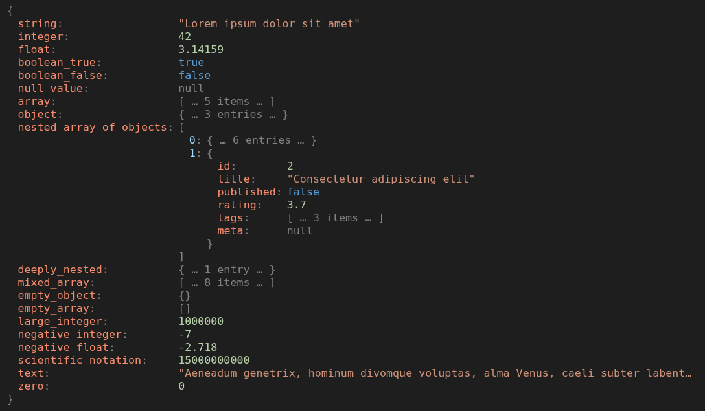
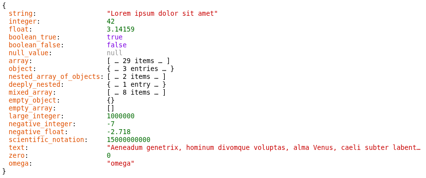

# json_flaneur.js

Taking a stroll down a JSON tree.

Inspired by the excellent [summerstyle/JsonTreeViewer](https://github.com/summerstyle/jsonTreeViewer).

## usage

```html
<!DOCTYPE HTML>
<html>

  <head>
    <title>json_flaneur.js — test</title>

    <script src="src/json_flaneur.js"></script>

    <link rel="stylesheet" href="reset.css">
      <!-- http://meyerweb.com/eric/tools/css/reset/ v2.0 | 20110126 -->

    <link rel="stylesheet" href="src/json_flaneur.css">

    <style>
      body { font-size: 10pt; }
      #flaneur .jflaneur { padding: 0.77em; }
    </style>
  </head>

  <body>

    <!-- TEST -->

    <div id="flaneur"></div>

    <script defer>

      let js = {
        "string": "Lorem ipsum dolor sit amet",
        "integer": 42,
        "float": 3.14159,
        "boolean_true": true,
        "boolean_false": false,
        "null_value": null,
        "array": [ "Lorem", "ipsum", "dolor", "sit", "amet" ],
        "object": { "name": "Lorem Ipsum", "origin": "Cicero", "year": 45 },
        "nested_array_of_objects": [
          { "id": 1, "title": "Lorem ipsum dolor", "published": true,
            "rating": 4.5, "tags": ["lorem", "ipsum"], "meta": null },
          { "id": 2, "title": "Consectetur adipiscing elit",
            "published": false, "rating": 3.7,
            "tags": ["dolor", "sit", "amet"], "meta": null
          }
        ],
        "deeply_nested": {
          "level_1": {
            "level_2": {
              "level_3": {
                "message": "Sed ut perspiciatis unde omnis", "value": 99,
                "active": true, "data": null, "items": [ 1, 2, 3 ]
              }
            }
          }
        },
        "mixed_array": [
          "Lorem ipsum", 42, 3.14, true, false, null,
          { "key": "value" }, [ 1, 2, 3 ]
        ],
        "empty_object": {},
        "empty_array": [],
        "large_integer": 1000000,
        "negative_integer": -7,
        "negative_float": -2.718,
        "scientific_notation": 1.5e10,
        "text": `
Aeneadum genetrix, hominum divomque voluptas, alma Venus, caeli subter labentia
signa quae mare navigerum, quae terras frugiferentis concelebras, per te
quoniam genus omne animantum concipitur visitque exortum lumina solis: te, dea,
te fugiunt venti, te nubila caeli adventumque tuum, tibi suavis daedala tellus
summittit flores, tibi rident aequora ponti placatumque nitet diffuso lumine
caelum.
          `.trim(),
        "zero": 0 };

      let fe = JsonFlaneur.make(js);
      fe.classList.add('jflaneur-dark');

      document.getElementById('flaneur').appendChild(fe);

      //fe.jfCollapse();
        // collapse all

      fe.jfCollapse(function(e) {
        console.log(e.jf);
        if (e.jf.depth === 0) return false; // keep uncollapsed
        return true; // collapse
      });
    </script>
  </body>
</html>
```

This gets rendered like this on my local Chrome:



(Opened a few of the items to show nesting)


## `JsonFlaneur.make()`

```js
let fe = JsonFlaneur.make(js);
  // or
let fe = JsonFlaneur.make(parentElt, js);
  // or
let fe = JsonFlaneur.make(parentElt, js, '.jflaneur-dark');
```

The order of those `make()` argument does not matter, as long as at least an array or an object is given.

Passing a element makes JsonFlaneur append the flaneur element it makes to that parent element:

```js
let fe = JsonFlaneur.make(js);
document.getElementById('flaneur').appendChild(fe);
  //
  // --shorter-->
  //
let fe = JsonFlaneur.make(document.getElementById('flaneur'), js);
```

Passing a class name (roughly a string that starts with a `dot`) makes JsonFlaneur add the class to the flaneur element it makes:

```js
let fe = JsonFlaneur.make(js);
fe.classList.add('jflaneur-dark');
document.getElementById('flaneur').appendChild(fe);
  //
  // --shorter-->
  //
JsonFlaneur.make(document.getElementById('flaneur'), js, '.jflaneur-dark');
```


## `jfCollapse()`

TODO


## themes

The default theme is "light".




### `.jflaneur-dark`

The theme `.jflaneur-dark` is shown in the top screenshot above.

### `.jflaneur-key-right`

TODO

### `.jflaneur-key-indent`

TODO


## LICENSE

MIT, see [LICENSE.txt](LICENSE.txt)

